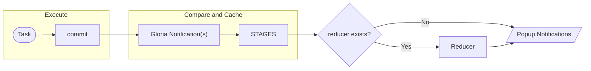

<p align="center">
  
</p>

<h1 align="center">Gloria-X</h1>

<p align="center">
  <a href="https://github.com/LightAPIs/Gloria-X/releases/latest">
    
  </a>
  <a href="https://chrome.google.com/webstore/detail/npdafhgodaenfglcfkkbnmdbfkgfadbh">
    
  </a>
  <a href="https://microsoftedge.microsoft.com/addons/detail/ijhoikcicadeigejkkknglnhbcfkfkkc">
    
  </a>
  <a href="https://github.com/LightAPIs/Gloria-X/releases/latest">
    
  </a>
  <a href="./LICENSE">
    
  </a>
</p>

- English
- [中文版](/README.md)

> A programmable website notifications aggregator
>
> **Original project：**[BlackGlory](https://github.com/BlackGlory)/[Gloria](https://github.com/BlackGlory/Gloria) [](https://raw.githubusercontent.com/BlackGlory/Gloria/master/LICENSE)

Timed a custom JavaScript code task, implement the automation work such as web monitoring or forum check-in, and pop up notifications.

## Table of contents

<details>
<summary>Table of contents</summary>

- [Installation](#installation)
  - [Chrome](#chrome)
  - [Edge](#edge)
  - [Firefox](#firefox)
- [Usage](#usage)
  - [Gloria Notification object structure](#gloria-notification-object-structure)
    - [Introduction to object properties](#introduction-to-object-properties)
  - [commit](#commit)
    - [Task classification](#task-classification)
      - [Observation task](#observation-task)
      - [General task](#general-task)
    - [Task difference](#task-difference)
  - [Access URL](#access-url)
    - [Access URL example](#access-url-example)
  - [Load external scripts async](#load-external-scripts-async)
- [Extra features](#extra-features)
  - [Select page elements for monitoring](#select-page-elements-for-monitoring)
- [Advanced options](#advanced-options)
  - [Debug task code](#debug-task-code)
  - [Observe the internal state](#observe-the-internal-state)
  - [Custom RequestHeaders](#custom-RequestHeaders)
  - [Reducer](#reducer)
    - [Introduction](#introduction)
    - [Operation mode](#operation-mode)
    - [Effect](#effect)
    - [Specific usage](#specific-usage)
    - [Example](#example)
      - [Filter notifications](#filter-notifications)
      - [Modify notifications](#modify-notifications)
      - [Send to Pushbullet](#send-to-pushbullet)
    - [Test Rudecer](#test-rudecer)
- [Other](#other)
  - [On-time mode](#on-time-mode)
  - [Other features](#other-features)
- [Related documents](#related-documents)
- [Limitations of Firefox version](#limitations-of-firefox-version)
- [Development](#development)
  - [Environment](#environment)
  - [Initialization](#initialization)
  - [Build](#build)
- [Related projects](#related-projects)
- [Licence](#licence)

</details>

## Installation

### Chrome

1. Go to the [Chrome Web Store](https://chrome.google.com/webstore/detail/npdafhgodaenfglcfkkbnmdbfkgfadbh) to download and install.
2. Start the browser and type `chrome://extensions/` in the address bar to enter Extensions Page, click the switch in the upper right corner of the webpage to turn on "Developer mode":

- a. Go to the [Releases](https://github.com/LightAPIs/Gloria-X/releases/latest) to download the extension `crx` file. Drag to Extensions Page to install.
- b. Go to the [Releases](https://github.com/LightAPIs/Gloria-X/releases/latest) to download the extension package `zip` file and unzip it. And click "Load unpacked" button, select the root directory of the previously unzipped file to complete the installation of the extension.

### Edge

- Go to the [Microsoft Edge Addons](https://microsoftedge.microsoft.com/addons/detail/gloriax/ijhoikcicadeigejkkknglnhbcfkfkkc) to download and install.

### Firefox

- Go to the [Releases](https://github.com/LightAPIs/Gloria-X/releases/latest) to download `xpi` file and install. _(Because the permission `unsafe-eval` is declared, it can not be put on Mozilla Add-ons.)_

## Usage

JavaScript is the only programming language supported by Gloria-X. The task creates the notification by passing a `Gloria Notification` object or an array composed of this object to a specific callback function `commit`. Gloria-X internally processes the parameter of the `commit` function and determines the content of the push notification based on the parameter.

For example, the following simple task code is actually runnable, which executes after each set interval and pops up a notification about the timestamp:

```javascript
commit({
  message: Date.now().toString(),
});
```

_Of course, this task code itself is meaningless, just a simple example._

### Gloria Notification object structure

The display content of the notification message depends on the passed attribute value of the `Gloria Notification` object, so first you need to understand the structure of the object.

The structure of the `Gloria Notification` object as follows:

```javascript
{
  title: String,    // The default is "", the title of the push notification
  message: String,  // The default is "", the content of the push notification
  iconUrl: String,  // The default is undefined, the icon of the push notification
  imageUrl: String, // The default is undefined, an image displayed on the push notification (Firefox notification ignores this attribute)
  url: String,      // The default is undefined, the URL opened when the push notification is clicked
  id: String,       // The default is undefined, which is used to detemine whether the notification is the same. If there is no speciffic requirement, there is generally no need to specify manually
}
```

_For security and to avoid the possibility of some unknown errors, the extension will ignore other attributes on the `Gloria Notification` object during internal processing._

#### Introduction to object properties

> Tip: All object attribute types above are **optional** `String`. When writing task code, do not directly pass other types that may be implicitly converted to `String` (such as: `Number`, `Boolean`, etc.). If you do so, the extension will think that the passed attribute type is error, so be sure to manually convert the value to the `String` type by youself.

- `title`
  - Type: `String`
  - Default: `""`
  - Meaning: The title of the push notification.
  - This attribute value will be used to detemine with the old notification in the STAGES cache.
  - For example: in an [Observation task](#Observation-task), if the `title` value of the new object is different from the `title` value of the old object in the STAGES cache, the new object will be jedged as a new notification and need to be pushed.
- `message`
  - Type: `String`
  - Default: `""`
  - Meaning: The body content or description of the notification
  - This attribute value will be used to detemine with the old notification in the STAGES cache.
  - Tip: If you need to treat two objects with the same `title` and `message` attribute values as two different notifications for a requirement, you can specify wto different `id` attribute values for the object, these two objects will then be treated as two different objects.
- `iconUrl`
  - Type: `String`
  - Default: `undefined`
  - Meaning: The icon information displayed in the push notification.
  - If the `iconUrl` attribute is no specified in the object, the extension provides a default icon value of `"icons/app/icon-128.png"` (the Gloria-X icon).
- `imageUrl`
  - Type: `String`
  - Default: `undefined`
  - Meaning: The image displayed on the push notification.
  - **Firefox notificaions ignore this attribute, meaning that the image is not displayed in notification, but is displayed in the notification history.**
- `url`
  - Type: `String`
  - Default: `undefined`
  - Meaning: The URL that opens when the push notification is clicked.
- `id`
  - Type: `String`
  - Default: `undefined`
  - Meaning: Object id, which can be used to detemine with the old notification in the STAGES cache.

### commit

The `commit` function is a special function proviede by Gloria-X to the task code. The task code is written by passing the result of the data to be observed in the task code, the `Gloria Notification` object or an array of that object, as a parameter to `commit`.

According to the difference of the parameters passed to `commit`, tasks are divided into "**Observation task**" and "**General task**".

#### Task classification

##### Observation task

When a single `Gloria Notification` object is passed to the `commit` function, the task will be recognized as an "Observation task", which compares the `Gloria Notification` object obtained each time with the `Gloria Notification` object recorded last time, and pushes a new notification when it is not the same.

_Note: If `null` or `undefined` is returned in the Observation task, the execution result is ignored, not cached and used for comparison._

##### General task

When an array of `Gloria Notification` objects is passed to the `commit` function, the task will be recognized as a "General task", and each collection is cached in an internal "Stages" component so that the notification is pushed only when the object is new.

#### Task difference

The observing task will respond to changes in each result, based on the previous execution result; and the general task will only respond to new results, and do not handle past repeated execution results.

The difference between two types of tasks is explained in detail in two working task codes.

Suppose there are two tasks, one for the observation task and one for the general task.

```javascript
//* Observation task, a single object is passed in
(async () => {
  const { lodash: _ } = await importScripts('gloria-utils');
  return {
    title: _.random(1).toString(),
  };
})().then(commit);
```

```javascript
//* General task, an array is passed in
(async () => {
  const { lodash: _ } = await importScripts('gloria-utils');
  return [
    {
      title: _.random(1).toString(),
    },
  ];
})().then(commit);
```

_Of course, these two tasks have no practical meaning, only for testing and referencing the difference between the two tasks._

We used the `random` method in the `lodash` library for testing. Don't worry about what `importScripts ('gloria-utils')` is, as we will mention later, we only need to focus on the results of two tasks delivered to the `commit` function. In both tasks, the `title` attribute of the object is used `_.random(1).toString()` assignment, the result of which has only two possibilities, `"0"` or `"1"`.

When you actually run these two tasks, you will find:

In the Observation task, it is possible for the watch task to push new notification each time tha task is executed, as long as the `title` value of the object this time is different form the `title` value of the previous object.

The behavior of the General task is completely different. When you do it enough times, you will find that the General task only push a new notification once at most.

Because when the task is created, the task will be executed once, and the result of the first execution will be cached in the STAGES component. When a different result appears in the subsequent execution, a new notification will be pushed and the new result will be cached in the STAGES component. It is important that the General task is different from the Observation task, is not remove old results, but will be cached in the STAEGS component along with the new results. And because of the particularity of this example task, there are only two possible results, no matter what result the subsequent execution will get, it will be the same as one of the wto results cached in the STAGES component, which is impossible to push new notifications.

These are examples of the differencess between the two tasks, which can be observed in the internal state view panel of the options page.

### Access URL

Now that you know how to create notifications in the task code, the next step is to access the URL.

There are two access url in task code:

1. `fetch`

You can check the usage of `fetch` in the [Fetch API](https://developer.mozilla.org/en-US/docs/Web/API/Fetch_API). Note that `fetch` in the Gloria-X environment automatically appends the destination URL Cookie when creating the request, so that you can take advantage of the login status on the destination website. Of course, the displayed content of such a push notification may contain your private information. The speciffic display content depends on how the `Gloria Notification` object is written.

2. `XMLHttpRequest(XHR)`

You can check the usage of `XHR` in [XMLHttpRequest](https://developer.mozilla.org/en-US/docs/Web/API/XMLHttpRequest). Unlike `fetch`, `XHR` in Gloria-X does not automatically append Cookie to the target URL and can not get login status on the target website.

If you plan to use `XHR`, you may need to use a similar `Promise` encapsulation method in your task code:

```javascript
// Encapsulation method
function ajax(url, method = 'GET', headers = []) {
  return new Promise((resolve, reject) => {
    const xhr = new XMLHttpRequest();
    xhr.open(method, url);
    headers.forEach(head => {
      xhr.setRequestHeader(head.name, head.value);
    });
    xhr.responseType = 'json';
    xhr.onload = res => {
      resolve(res.target.response);
    };
    xhr.onerror = res => {
      reject(res.target.response);
    };
    xhr.send();
  });
}

// Use ajax
ajax('...').then( ... ).catch( ... )
```

#### Access URL example

For example, create a simple Observation task that detects the latest version of this project:

```javascript
fetch('https://api.github.com/repos/LightAPIs/Gloria-X/releases/latest')
  .then(res => res.json())
  .then(json => {
    const message = json.tag_name;
    const url = json.html_url;
    commit({
      title: 'Gloria-X',
      message,
      url,
    });
  });
```

I also found a runnable task on Gloria's task code [sharing website](https://gloria.pub/).

[SaveCoins on Sale](https://gloria.pub/task/6042d625ab474400108be626):

```javascript
fetch('https://api-savecoins.nznweb.com.br/v1/games?currency=USD&locale=en&order=discount_begin_date_desc&filter[on_sale]=true')
  .then(res => res.json())
  .then(json => {
    let notifications = json.data
      .map(feed => {
        return {
          title: '[' + feed.platform.slice(0, 1).toUpperCase() + '] Before ' + feed.price_info.discountPrice.discountEndsAt.split('T')[0],
          message:
            '[' +
            feed.price_info.country.code +
            '] ' +
            feed.price_info.discountPrice.originalDiscountPrice +
            ' (-' +
            feed.price_info.discountPrice.percentOff +
            '%)\n' +
            feed.title,
          url: 'https://savecoins.app/game/' + feed.slug,
          iconUrl: feed.imageUrl,
          disc: feed.price_info.discountPrice.percentOff,
        };
      })
      .filter(({ disc: x }) => x > 80);
    commit(notifications);
  });
```

If you know `fetch` or `XHR`, you should be able to understand how to access the URL in the task code through these tasks.

### Load external scripts async

While the URL is already accessible in the task code, not all sites have an API similar to the JSON format data returned in the example above. At this time, you need access the URL directly and read the HTML content, and then process the HTML through modules such as `cheerio`.

In the Gloria-X, external scripts can be loaded via the `importScripts` method like a Web Worker.

It should be noted that, unlike the Web Worker runnnig environment, Gloria-X will create a virtual `window` object to make some external scripts work normally, and the `importScripts` method has been transformed into an async method, which only supports a single parameter. You can call it like this:

```javascript
importScripts('script.js')
  .then(script => {
    ...
  })
```

When the async `importScripts` method is called to load an external script, a `Promise` object is returned. The first parameter received by the callback function of `Promise.then` is the return value of the loaded external script.

Gloria-X and Gloria also have some commonly used modules built in, and these modules can be loaded through `importScripts('gloria-utils')`. The available modules are shown in the following table:

|                                                Module                                                | Version |
| :--------------------------------------------------------------------------------------------------: | :-----: |
|               export `cheerio` from '[cheerio](https://github.com/cheeriojs/cheerio)'                | 0.22.0  |
|                          export `co` from '[co](https://github.com/tj/co)'                           |  4.6.0  |
|                  export `cookie` from '[cookie](https://github.com/jshttp/cookie)'                   |  0.3.1  |
|         export `immutable` from '[immutable](https://github.com/immutable-js/immutable-js)'          |  3.8.1  |
|                  export `is` from '[is_js](https://github.com/arasatasaygin/is.js)'                  |  0.9.0  |
|                  export `lodash` from '[lodash](https://github.com/lodash/lodash)'                   | 4.16.4  |
|                  export `moment` from '[moment](https://github.com/moment/moment)'                   | 2.18.1  |
|                        export `qs` from '[qs](https://github.com/ljharb/qs)'                         |  6.3.0  |
|                    export `ramda` from '[ramda](https://github.com/ramda/ramda)'                     | 0.24.1  |
|                 export `rx` from '[rx](https://github.com/Reactive-Extensions/RxJS)'                 |  4.1.0  |
|     export `sanitizeHtml` from '[sanitize-html](https://github.com/apostrophecms/sanitize-html)'     | 1.13.0  |
|              export `SystemJS` from '[systemjs](https://github.com/systemjs/systemjs)'               | 0.20.14 |
| export `underscoreString` from '[underscore.string](https://github.com/esamattis/underscore.string)' |  3.3.4  |
|          export `validator` from '[validator](https://github.com/validatorjs/validator.js)'          |  7.1.0  |
|          export `xml2js` from '[xml2js](https://github.com/Leonidas-from-XIV/node-xml2js)'           | 0.4.17  |
|               export `XRegExp` from '[xregexp](https://github.com/slevithan/xregexp)'                |  3.2.0  |

For example, you can use `cheerio` to parse a page:

```javascript
(async () => {
  const { cheerio } = await importScripts('gloria-utils');
  const html = await fetch('https://github.com/LightAPIs/Gloria-X/releases').then(res => res.text());
  const $ = cheerio.load(html);
  return $('.release-main-section.commit')
    .map((_i, ele) => {
      const link = $(ele).find('.release-header .f1 a');
      const title = link.text().trim();
      const url = 'https://github.com/' + link.attr('href');
      return {
        title,
        url,
      };
    })
    .get();
})().then(commit);
```

## Extra features

### Select page elements for monitoring

> _v1.2.0 +_

The feature can be found in the right-click menu of the web page or the right-click menu of the extension icon.

After triggering this feature, it will enter the mode of selecting web page elements. You can click on the elements in the web page with the left mouse button, hold down the Ctrl key while you can make multiple selections. After completing the element selection, click the "Generate" button to generate the corresponding task code. The next step is to test the task code, which executes successfully to create the task.

It is important to note that this feature is essentially a shortcut generator for [Observation task](#Observation-task). In principly, it can not generate [General task](#General-task), and it may not be able to monitor all types of web pages, such as dynacically loaded web pages based on Ajax technology.

## Advanced options

### Debug task code

The panel for debugging tasks can be found in the "Task debug" tab of the extension options page.

After entering the task code to be debugged in the code input box, click the "Testing" button at the top of the page to view the test output results (of course, the task code executed async may have to wait a while), and the test results obtained are both It does not pass through the internal STAGES component (a component used to cache notifications) or the Reducer function (see later introduction), but directly generates the corresponding notifications.

Errors such as syntax errors in the task code are also displayed in the panel (_Note: It only supports capturing the errors of synchronous code, and the errors of asynchronous code or the output of 'console' statement in the code need to open the background page<"background.html"> to view_)。

### Observe the internal state

The panel for observing the internal state can be found in the "Internal state" tab of the extension options page.

Here, you can observe the real-time state of "Notification Records", "Gloria-X tasks" and "STAGES" components stored internally.

At the same time, buttons for cleaning up are provided at the bottom of the page.

### Custom RequestHeaders

> _v2.6.0+_

The panel for Custom RequestHeaders can be found in the "RequestHeaders" tab of the extension options page.

Here, you can manually supply values for some message headers that [Forbidden header name](https://developer.mozilla.org/en-US/docs/Glossary/Forbidden_header_name).

_Note: The settings here override some of the same name values that are automatically attached within the extension, such as `Cookie`._

### Reducer

The Reducer settings panel can be found in the "Reducer" tab of the extension options page.

#### Introduction

If you need to perform some secondary operations on the new notifications obtained after the task is executed before being officially pushed, then you need to use the Reducer function. The Reducer function is a special function provided by Gloria-X. Unlike the `commit` function in the previous task code, it does not appear in the task code, but is set separately in the options page. If you provide a Reducer function, then all tasks will use the same Reducer function.

#### Operation mode

Reducer is a synchronously executed function. When a new `Gloria Notification` object needs to be pushed after a task is executed, the object will be passed as a parameter to the Reducer function to perform an operation.

Note: Before the Reducer function is executed, the comparison and caching of notifications have been completed. The operation of the Reducer function will only affect the content of the subsequent notifications and records.

Its execution timing is probably as follows:



#### Effect

In the Reducer function, you can complete the operations of modification, filtering, and sending to third-party services (For example: [Pushbullet](https://www.pushbullet.com/)、[Pushover](https://pushover.net/) etc.) via HTTP requests to synchronize notifications to other devices.

#### Specific usage

The Reducer receives a `Gloria Notification` object as a parameter, and optionally returns a new `Gloria Notification` object. The return value will be used to pop up new notifications. If the function does not provide a return value or returns a `null`, it is considered discarded, no new notification will pop up, and it will not be seen in the notification record.

#### Example

##### Filter notifications

Filter out notifications that contain the string "sad" in `message`:

```javascript
function reducer(notification) {
  if (notification.message.includes('sad')) {
    return null;
  }
  return notification;
}
```

##### Modify notifications

Modify "sad" in `message` to "happy":

```javascript
function reducer(notification) {
  notification.message = notification.message.replace('sad', 'happy');
  return notification;
}
```

##### Send to Pushbullet

You can synchronize notification messages to other devices through Pushbullet. For more information on how to use Pushbullet, please refer to the [official documentation](https://docs.pushbullet.com/).

```javascript
function reducer(notification) {
  const { title, message, url } = notification;
  const data = {
    type: 'note',
    title,
    body: message,
    device_iden: '...', //? Optional, device id
  };
  url &&
    Object.assign(data, {
      type: 'link',
      url,
    });
  fetch('https://api.pushbullet.com/v2/pushes', {
    method: 'POST',
    headers: new Headers({
      'Access-Token': 'o.xxx', //! Your access token
      'Content-Type': 'application/json',
    }),
    body: JSON.stringify(data),
  });
  return notification;
}
```

[Here](https://gloria.pub/task/60157ce3ab474400108be625) is the version using Pushover. For more interfaces of other tools, please refer to its documentation.

#### Test Rudecer

In the Reducer settings panel, you can also perform some simple tests on the Reducer functions you have written.

You can fill in a **JSON string** serialized by the `Gloria Notification` object or its array in the test object input box. In fact, it directly simulates the result of a task execution. Then click the test button to view the return value of the Reducer function and the effect of the pop-up notification.

As for the code error of the Reducer function or the output of using the `console` statement in the Reducer function, you need to open the background page<"background.html"> to view it.

Finally, I would like to remind you that you must use the Reducer function carefully.

## Other

### On-time mode

There is an optional option of `On-time mode` in the task, that is, the task performs the check strictly according to the given time interval.

If the task is enabled:

- Tasks in the default mode will always be executed automatically when starting the browser, and then set a timer based on the active time of the moment.

- Tasks that use the On-time mode will first determine whether the task has been executed since the last execution time exceeds the set execution interval when starting the browser. If it is still within the interval, the check will not be executed immediately, but according to the scheduled time The inspection will only be performed upon arrival.

### Other features

- Allow implicit push notifications (record notifications but no news prompts)
- Support for later review of notifications
- Allow filtering tasks and notification records
- Allow custom notification to sound
- You can operate tasks and notification records in the Popup page through the right-click menu

## Related documents

**For more specific details, please refer to:**

1. Gloria Chinese guide：https://docs.gloria.pub/
2. Task code sharing website：https://gloria.pub/

## Limitations of Firefox version

There are some functional limitations in Firefox due to the different levels of API support available.

Here are some of the features that Firefox <u>doesn’t support</u> in comparison to Chrome:

- The pop-up notification needs to be manually closed as an optional option
- Display the image in the pop-up notifications
- Provide action buttons in pop-up notifications

Here are some logical differences in Firefox:

- If the "Show the number of unread notifications mark on the extension icon" option is enabled, when the close button of the notification is clicked, the value of the number mark will not decrease. (If the notification is associated with a URL, it will decrease when you click the notification to open the URL.)

## Development

### Environment

- Install [Node.js](https://nodejs.org/) 16 (_`npm` is integrated_)

### Installation dependency

```bash
npm install
```

### Build

- Build the Chrome version: `npm run build-chrome`
- Build the Edge version: `npm run build-edge`
- Build the Firefox version: `npm run build-firefox`

## Related projects

Here, I would like to express my heartfelt thanks to Gloria author [BlackGlory](https://github.com/BlackGlory) and all related projects personnel. :heart:

- [BlackGlory/Gloria](https://github.com/BlackGlory/Gloria)
- [akanshgulati/scrap-favicon](https://github.com/akanshgulati/scrap-favicon)
- [CarterLi/vue3-ace-editor](https://github.com/CarterLi/vue3-ace-editor)
- [element-plus/element-plus](https://github.com/element-plus/element-plus)
- [GitHub-Laziji/menujs](https://github.com/GitHub-Laziji/menujs)
- [ReactiveX/rxjs](https://github.com/ReactiveX/RxJS)
- [Simonwep/selection](https://github.com/Simonwep/selection)
- [vuejs/vue-next](https://github.com/vuejs/vue-next)
- [yyf1994gggg/vuex-chrome](https://github.com/yyf1994gggg/vuex-chrome)

## Licence

[MIT](/LICENSE) License
